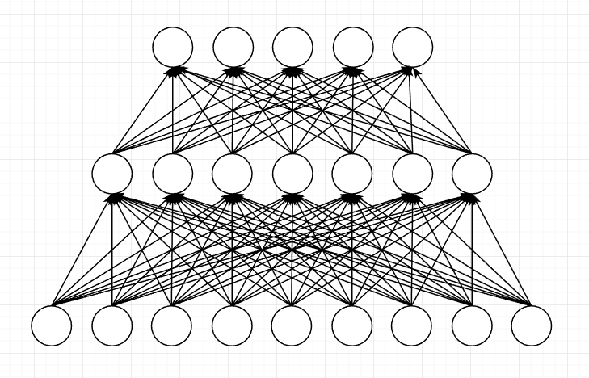
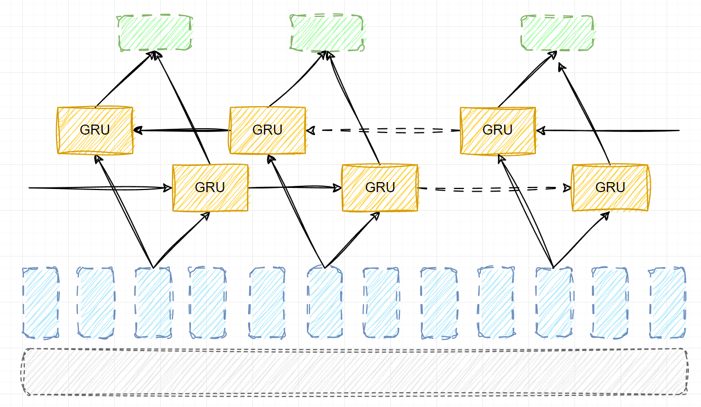
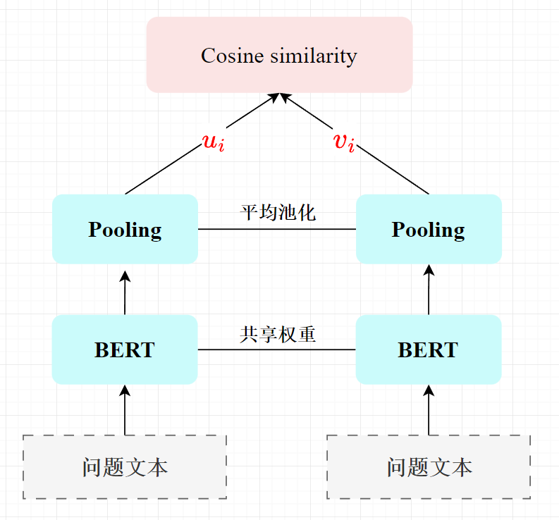

# draw.io 绘图 & PPT 模板分享 & 英语笔记

# 绘图模板

## 神经网络

		

## GRU 网络

		

## Sentence-BERT

		

# 常用表情

## 🤗  :sweat_smile:   :smirk:  🤔🧐    :yawning_face:   :bookmark_tabs:  :bookmark:  :point_down:   :point_up:   :raised_hands:   :clap: :open_hands:   :wave:  :ideograph_advantage:   :secret:  :underage:
## :sparkles:   :boom:   :part_alternation_mark:  :fire:   :zap:   :bell:    :cupid:   :heart:   :egg:   :cut_of_meat:   :milk_glass: :mailbox:    :scroll:   :ledger:   :chart_with_upwards_trend:   :question: :bangbang:

# 英语短句

> - 十句话一组

# 01

> - `She is more crying than laughing.`（与其说她是在笑，不如说她是在哭）
> - 

# 表格

| 编号 | 英文 | 翻译 | 备注 |
| :- | :- | -: | -: |
| 1 | `I married frontier technology.` | 一生致力于 |  |
| 2 | `Count me in/out.` | 算我一个 |  |
| 3 | `It's Greek to me.` | 如同天书 |  |
| 4 | `You've got me there.` | 这可难住我了 |  |
| 5 | `Match made in heaven.` | 天生一对、天作之合 |  |
| 6 | `A piece of cake.` | 小菜一碟 | :clap: |
| 7 | `It depends.` | 视情况而定 |  |
| 8 | `One will do me.` | 一份就够 | :clap: |
| 9 | `Never is a long word.` | 不要轻易说决不 |  |
| 10 | `You really flatter me.` | 过誉过奖了 |  |
| 11 | `His work really beats nature!` | 巧夺天工 |  |
| 12 | `Success is often an idea away.` | 成功与否一念之差 | away |
| 13 | `You have my sympathy.` | 深表同情 |  |
| 14 | `She has a weakness for chocolate.` | 她特别爱吃巧克力 |  |
| 15 | `Somebody has talked.` | 告密 |  |
| 16 | `Cry and you cry alone.` | 泪来自承担 | :clap: |
| 17 | `Haste makes waste.` | 欲速则不达 |  |
| 18 | `A dreamboat.` | 理想型 | :clap: |
| 19 | `The facts will tell.` | 用事实说话 |  |
| 20 | `There are friends and friends.` | 朋友跟朋友不一样 | 质地优劣 |
| 21 | `Of soup and love , the first is the best.` | 第一次最好 |  |
| 22 | `After much labor.` | 费了好大的劲 |  |
| 23 | `He is being polite.` | 眼下有礼貌 | 进行时暗示暂时情况 |
| 24 | `That's really more than I can tell you.` |  | 委婉含蓄地拒说 |
| 25 | `A slow season` | 淡季 |  |
| 26 | `A slow Sunday` | 一个悠闲的星期天 |  |
| 27 | `Hope dies slowly.` | 迟迟不肯放弃希望 |  |
| 28 | `Only slowly have they begun to realize their mistake.` | 迟迟没有认识到错误 |  |
| 29 | `What's in your mind?` | 你在想什么 |  |
| 30 | `What's on your mind?` | 你在愁什么 |  |
| 31 | `He made a great difference.` | 有他没他，大不一样 |  |
| 32 | `There is no smoke without fire.` | 无风不起浪 |  |
| 33 | `There is no fire without smoke.` | 凡事有利有弊 |  |
| 34 | `Then come and kiss me , sweet and twenty.` |  | |
| 35 | `He is a green hand.` | 新手 | |
| 36 |  |                    |  |
| 37 | `He is a heavy smoker.` |  | |
| 38 | `He is an early riser.` | 起得很早 | 英语表达喜欢用名词 |
| 39 | `Calculation never made a hero.` | 举棋不定 |  |
| 40 | `Plenty of vegetable will do you good.` | 多吃蔬菜有好处 |  |
| 41 | `That's streets cheaper.` | 便宜多了 | streets （adv） |
| 42 | `He was way ahead / behind.` | 大大领先/落后 | way（adv） |
| 43 | `She is all legs.` | 细长高挑 |  |
| 44 | `He is all smiles/eyes/attention/tears/muscle.` |  |  |
| 45 | `You read too much into the text.` | 过度理解 | read into |
| 46 | `She read love into his sympathy.` | 牵强附会 | read into |
| 47 | `no fewer than` | 多达（强调多） | 反向修辞强调 |
| 48 | `no more than` | 仅有（强调少） |  |
| 49 | `no wiser than` |  |  |

# 表格模板

折叠

| 编号 | 英文 | 翻译 | 注释 |
| :- | :-: | -: | -: |
| 1 |  |  |  |
| 2 |  |  |  |
| 3 |  |  |  |
| 4 |  |  |  |
| 5 |  |  |  |
| 6 |  |  |  |
| 7 |  |  |  |
| 8 |  |  |  |
| 9 |  |  |  |
| 0 |  |  |  |

